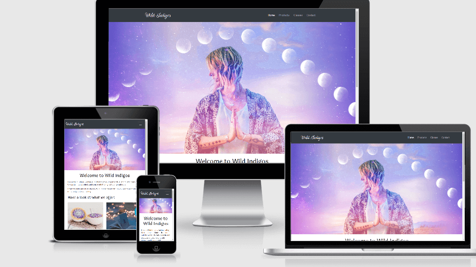

# *Wild Indigos*

Wild Indigos is a spiritual and holistic minded brand and community.
We promote whole body health and wellness. Our mindful approach to healthy and connected living drives our community bond and we want this website to represent the beauty of that.

 
  
Live site hosted on Github pages [HERE](https://susanmarie87.github.io/WildIndigosTake51/index.html)

 # UX
*   As a user, I want to browse merchandise.

     The merchandise section can be found by clicking “Products” on the navigation bar. Upon arrival to the products page, user can use scroll feature to find the specific card for bracelets. 
     The user will then be greeted with a “Coming Soon” button as this is MS1 and I have yet to learn how to implement a wide variety of products or a shopping cart. 

* As a user, I want to search for body products.

    The body products section can be found by clicking “Products” on the navigation bar. Upon arrival to the products page, user can use scroll feature to find the specific card for bracelets. 
    The user will then be greeted with a “Coming Soon” button as this is MS1 and I have yet to learn how to implement a wide variety of products or a shopping cart. 

* As a user I want to sign up for classes.

    The user can click the “Classes” link on the navigation bar. Upon arrival at the Classes page. The user will be met with a “Sign Up!” button. 
    The user will then click the button and form will appear. 

*	As a user I want an obvious navigation link that lets me easily go to different pages in the site.

    The site is equipped with an easy to find navigation bar. The links are fully functioning. 

*   As a user  I want to easily be able to view the website on any size screen.
     
       The site is designed to be mobile responsive.

# Wireframes  

 * [Basic Wireframes](https://github.com/susanmarie87/WildIndigosTake51/blob/master/assets/wireframes/basic-wireframes.pdf) 

 * [Final Wireframes](https://github.com/susanmarie87/WildIndigosTake51/blob/master/assets/wireframes/Wireframes.pdf)

# Existing Features

*   Navigation bar allows users to easily choose the different pages they would like to visit.

*	Footer  allows users to easily access our media sites where they have a chance to have more interaction with our brand.

*	Forms that allow users to contact us.

*   Social links allow users to easily acces our site.

# Features Left to Implement

*	A Product Listing Page needs to be added.

*	A Shopping Cart feature needs to be added.

# Technologies Used

1.	HTML5

2.	CSS

3.	Bootstrap

4.   Github 

5.   Git

6.   W3C validation

 # Testing

*    Each page on the website was tested for screen resposiveness to ensure breakpoints.

*    The code was ran through each specific validator to make sure it passed.
   
*    Tested all fields on Contact Form to ensure error would appear if text was missing.

*    Tested links on Landing Page to ensure they went to desired areas.

*    Tested all links on Navbar to ensure they worked.

*    Tested Wild Indigos links on Footer to ensure that link worked properly.

*    Tested all social media links

*    Ran HTML code through WS3 Markdown validator. Minor warnings appeared regarding button element not permitted in the "a" element. Resolved this by replacing button element with div element

*    Removed unnecessary code that was flagged in HTML validator.

*    Ran CSS through WS3 validator- PASSED. 

# Deployment

* Wild Indigos has been deployed on GitHub Pages with the following process:

* All code was written on Gitpod, a cloud-based IDE.

* The code was then pushed to GitHub where it is stored in my Repository.

* Under the Settings section of the GitHub repository, scroll down to GitHub Pages section.

* Under 'Source' drop-down, the 'Master branch' was selected.

* Once selected, this publishes the project to GitHub Pages and displays the site URL.

* There is no difference between the deployed version and the development version.

* The code can be run locally through clone or download. You can do this by opening the repository,
  clicking on the green 'Code' button and selecting either 'clone or download'.

* The Clone option provides a URL, which you can use on your desktop IDE.

* The Download ZIP option provides a link to download a ZIP file which can be unzipped on your local machine or uploaded to your cloud-based IDE workspace.

 # Credits

*   The contact form was adapted from WS3 schools: https://www.w3schools.com/

*	The images were adapted from: https://www.unsplash.com

*   Navbar and Cards were adapted from: http://www.bootstrap.com

*   The responsive screen image was taken from: http://ami.responsivedesign.is/
 
*   The images were resized with: https://tinypng.com/

*   The font was adapted from: https://googlefonts.com/

*   The icons were adapted from: https://fontawesome.com/

*   Opening Image adapted from: https://zennedout.com/

 # Acknowledgements

*	Code Institute

*	ALL of the Tutors who have helped me up to this point.

*	Slack. For where would any new developers be without Slack? Shoutout to old school developers that had to learn without that support system. 
    Specifically Anna Greaves and Simen Daehlin aka "Grandmaster Yoda," as it is always, at least 95% of the time, their answers that pop-up when I search for something on Slack. 
    Those two could run the entire code world. 

*	Ignatius Ukwuoma, my mentor, for helping to guide me through ideas for my project and giving me motivation.

*	Jim Lynx for helping me sort out a bracket and CSS issues as well as the valuable feedback and advice when I was ready to quit. Jim is a coding natural and should be hired immediately at
    Code Institute as a mentor upon completion. Or now for MS1 projects. 

*	Kevin Powell and his very awesome and concise videos. 

*	Learn Code Institute for their videos as well.

